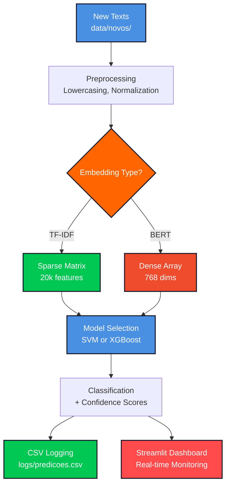

# NewsLens AI Classifier

<div align="center">
  
  
  <h1>
    
  </h1>
  
  <samp>UFRN · Electrical Engineering · ELE 606 – Final Project</samp>
  <br/><br/>
  
  
  
  
  
</div>

<br/>

## `> project.overview()`

```python
class NewsLensClassifier:
    def __init__(self):
        self.title = "NewsLens AI Classifier"
        self.subtitle = "Sparse vs Dense Embeddings: A Production Trade-off Study"
        self.dataset = "Brazilian Portuguese News (315 samples, 6 categories)"
        self.institution = "UFRN - Federal University of Rio Grande do Norte"
        self.department = "Center of Technology - Electrical Engineering Dept."
        self.course = "ELE 606 - Final Project"
        self.professor = "Prof. José Alfredo F. Costa"
        self.author = "Cauã Vitor Figueredo Silva"
        self.student_id = "20220014216"
        self.email = "cauavitorfigueredo@gmail.com"
        self.date = "December 2024"
        self.python_version = "3.8+"
    
    def embeddings(self):
        return {
            "E1_TF-IDF": {
                "type": "Sparse (Bag-of-Words)",
                "features": "20,000 (unigrams + bigrams)",
                "storage": "CSR Matrix (.npz)",
                "cold_start": "0.08s",
                "size": "0.18 MB"
            },
            "E2_BERT": {
                "type": "Dense (Transformer)",
                "model": "neuralmind/bert-base-portuguese-cased",
                "dimensions": 768,
                "pooling": "Mean Pooling",
                "cold_start": "2.23s",
                "size": "0.88 MB"
            }
        }
    
    def classifiers(self):
        return {
            "M1_SVM": {
                "kernel": "Linear",
                "class_weight": "balanced",
                "probability": True
            },
            "M2_XGBoost": {
                "n_estimators": 100,
                "max_depth": 6,
                "n_jobs": -1
            }
        }
    
    def production_features(self):
        return [
            "Stratified Train/Val/Test Split (60/20/20)",
            "Prediction Logging System (CSV)",
            "Streamlit Monitoring Dashboard",
            "Groq LLM Integration (llama-3.3-70b-versatile)",
            "Class Profiling & Differential Error Analysis",
            "Batch Processing Pipeline",
            "Real-time Classification API"
        ]
    
    def final_results(self):
        return {
            "best_model": {
                "name": "BERT + SVM",
                "f1_macro": 1.0,
                "accuracy": 1.0,
                "latency": "0.12 ms/doc"
            },
            "efficiency_champion": {
                "name": "TF-IDF + SVM",
                "f1_macro": 0.968,
                "accuracy": 0.968,
                "latency": "0.14 ms/doc",
                "cold_start_advantage": "28x faster"
            },
            "key_insight": "TF-IDF achieves 96.8% of BERT performance with 28x faster cold start"
        }
```

<br/>

## `> tech_stack`

<div align="center">
  
</div>

<table align="center">
<tr>
<td align="center" width="33%">
<strong>🤖 NLP & Embeddings</strong><br/><br/>


</td>
<td align="center" width="33%">
<strong>⚡ ML Models & LLM</strong><br/><br/>


</td>
<td align="center" width="33%">
<strong>🎨 Web & Visualization</strong><br/><br/>


</td>
</tr>
</table>

<br/>

## `> project_structure`

```
newslens-classifier/
│
├── 📊 data/
│   ├── raw/                    # Original news dataset (315 samples, 6 classes)
│   ├── processed/              # Preprocessed texts and labels
│   ├── embeddings/             # TF-IDF (.npz) + BERT (.npy)
│   └── novos/                  # Production batch classification queue
│
├── 🧠 src/
│   ├── config.py               # Centralized configuration
│   ├── preprocessing.py        # Unified text preprocessing
│   ├── data_loader.py          # Polymorphic data loading
│   ├── embeddings.py           # Embedding generation (TF-IDF/BERT)
│   ├── train.py                # Training pipeline
│   ├── evaluate.py             # Evaluation & metrics
│   ├── llm_analysis.py         # Groq API integration
│   ├── logging_system.py       # CSV prediction logging
│   └── class_mapping.py        # Category mappings
│
├── 🚀 scripts/
│   ├── run_phase2.py           # Training & evaluation
│   ├── run_phase3.py           # LLM analysis & profiling
│   ├── processar_novos.py      # Batch production script
│   └── test_production.py      # Production validation
│
├── 🎨 apps/
│   └── app_streamlit.py        # Web interface (classification + monitoring)
│
├── 💾 models/                  # Trained models & artifacts
│   ├── *.pkl                   # Serialized models (4 combinations)
│   ├── table_*.csv             # Performance tables
│   ├── cm_*.png                # Confusion matrices
│   ├── class_profiles.json     # LLM class archetypes
│   └── differential_errors.json # Error analysis
│
├── 📈 logs/
│   └── predicoes.csv           # Timestamped predictions
│
├── 📄 reports/
│   ├── relatorio.tex           # LaTeX report (10-20 pages)
│   └── prompt_gamma_ai.md      # Presentation script
│
├── .env                        # Groq API key (not in git)
├── .env.example                # Environment template
├── requirements.txt
└── README.md
```

<br/>

## `> methodology`

<table align="center">
<tr>
<td width="50%">
<h3 align="center">🎯 Embedding Comparison</h3>
<p align="center">


</p>
<p><samp><strong>TF-IDF:</strong> 20k features, unigrams + bigrams, fast cold start (0.08s), lexical matching</samp></p>
<p><samp><strong>BERT:</strong> 768 dimensions, contextual embeddings, slower cold start (2.23s), semantic understanding</samp></p>
</td>
<td width="50%">
<h3 align="center">⚖️ Classifier Benchmarking</h3>
<p align="center">


</p>
<p><samp><strong>SVM:</strong> Linear kernel, balanced weights, probability calibration</samp></p>
<p><samp><strong>XGBoost:</strong> Gradient boosting, 100 trees, max_depth=6, parallel processing</samp></p>
</td>
</tr>
</table>

<br/>

## `> dataset_categories`

<div align="center">

### 📰 News Categories (6 Classes)


</div>

| Category | Description | Examples |
|----------|-------------|----------|
| **Economia** | Economic news, markets, business | GDP, inflation, stock market |
| **Esportes** | Sports, competitions, athletes | Football, Olympics, championships |
| **Polícia e Direitos** | Crime, law enforcement, civil rights | Investigations, arrests, protests |
| **Política** | Government, elections, public policy | Congress, elections, bills |
| **Turismo** | Travel, destinations, tourism industry | Hotels, attractions, travel tips |
| **Variedades e Sociedade** | Culture, entertainment, social issues | Celebrities, trends, lifestyle |

<br/>

## `> installation`

```bash
# Clone repository
git clone https://github.com/takaokensei/newslens-classifier.git
cd newslens-classifier

# Create virtual environment (Python 3.8+ required)
python3 -m venv venv
source venv/bin/activate  # Linux/Mac
# or
venv\Scripts\activate  # Windows

# Install dependencies
pip install -r requirements.txt

# Configure Groq API (for LLM features)
cp .env.example .env
# Edit .env and add your GROQ_API_KEY
```

### Dependencies (`requirements.txt`)

```
torch==2.0.1
transformers==4.33.0
sentence-transformers==2.2.2
scikit-learn==1.3.0
xgboost==1.7.6
pandas==2.0.2
numpy==1.24.3
matplotlib==3.7.1
seaborn==0.12.2
streamlit==1.28.0
plotly==5.17.0
groq==0.4.0
python-dotenv==1.0.0
```

<br/>

## `> quick_start`

### 1️⃣ Train Models

```bash
# Phase 2: Train and evaluate all 4 model combinations
python scripts/run_phase2.py

# Phase 3: Generate LLM class profiles and error analysis
python scripts/run_phase3.py
```

### 2️⃣ Launch Streamlit App

```bash
streamlit run apps/app_streamlit.py
```

**⚠️ Windows Users:** Always activate virtual environment first:

```powershell
.venv\Scripts\Activate.ps1
streamlit run apps/app_streamlit.py
```

### 3️⃣ Batch Production Classification

```bash
# Classify texts in data/novos/ directory
python scripts/processar_novos.py --model best

# Available models: best, tfidf_svm, tfidf_xgb, bert_svm, bert_xgb
```

<br/>

## `> model_performance`

<div align="center">

### 🏆 Benchmark Results

</div>

<table align="center">
<tr>
<td width="50%" align="center">
<h3>📊 Semantic Performance</h3>

| Model | F1-Macro | Accuracy |
|-------|----------|----------|
| **BERT + SVM** | **1.000** | **1.000** |
| **BERT + XGBoost** | 0.967 | 0.968 |
| TF-IDF + SVM | 0.968 | 0.968 |
| TF-IDF + XGBoost | 0.704 | 0.714 |


</td>
<td width="50%" align="center">
<h3>⚡ Efficiency Metrics</h3>

| Model | Latency (ms/doc) | Cold Start (s) | Size (MB) |
|-------|------------------|----------------|-----------|
| **TF-IDF + SVM** | **0.14** | **0.08** | **0.18** |
| TF-IDF + XGBoost | 0.42 | 0.11 | 0.49 |
| BERT + SVM | 0.12 | 2.23 | 0.88 |
| BERT + XGBoost | 0.38 | 2.30 | 0.43 |


</td>
</tr>
</table>

### 🎯 Key Findings

<table align="center">
<tr>
<td align="center" width="25%">
<strong>🏅 Perfect Classification</strong><br/><br/>
<samp><strong>BERT + SVM</strong> achieved F1=1.0 on test set, capturing all semantic nuances correctly</samp>
</td>
<td align="center" width="25%">
<strong>⚖️ Efficiency Champion</strong><br/><br/>
<samp><strong>TF-IDF + SVM</strong> delivers 96.8% performance with <strong>28x faster</strong> cold start</samp>
</td>
<td align="center" width="25%">
<strong>🎭 SVM Superiority</strong><br/><br/>
<samp>SVM outperforms XGBoost in <strong>both</strong> embedding types, better suited for text</samp>
</td>
<td align="center" width="25%">
<strong>🔍 Semantic Edge Cases</strong><br/><br/>
<samp>BERT essential for ambiguous cases (e.g., "Turismo" vs "Variedades")</samp>
</td>
</tr>
</table>

<br/>

## `> streamlit_features`

<div align="center">

### 🎨 Web Interface


</div>

<table align="center">
<tr>
<td align="center" width="50%">
<h3>📝 Classification Tab</h3>
<samp>
• Real-time text classification<br/>
• Model selection (4 combinations)<br/>
• Confidence scores per class<br/>
• LLM-generated explanations (Groq)<br/>
• Example texts for testing<br/>
</samp>
</td>
<td align="center" width="50%">
<h3>📊 Monitoring Dashboard</h3>
<samp>
• Prediction statistics (count, accuracy)<br/>
• Interactive charts (Plotly)<br/>
• Class distribution histogram<br/>
• Model usage breakdown<br/>
• Timestamped prediction logs (CSV)<br/>
</samp>
</td>
</tr>
</table>

<br/>

## `> llm_integration`

<div align="center">

### 🤖 Groq API Features


</div>

**1. Class Profiling (`class_profiles.json`)**
- AI-generated archetypal descriptions for each category
- Linguistic patterns, vocabulary, and tone analysis
- Used for explainable AI in Streamlit

**2. Differential Error Analysis (`differential_errors.json`)**
- Identifies edge cases where BERT succeeds but TF-IDF fails
- Semantic ambiguity detection
- Provides actionable insights for model selection

**Configuration:**
```bash
# .env file
GROQ_API_KEY=your_api_key_here
```

<br/>

## `> production_pipeline`

<div align="center">



</div>

<br/>

## `> evaluation_metrics`

<table align="center">
<tr>
<td align="center" width="25%">
<strong>🎯 Semantic Quality</strong><br/><br/>
<samp>
• Accuracy<br/>
• F1-Macro (balanced)<br/>
• F1 per class<br/>
• Confusion matrices<br/>
</samp>
</td>
<td align="center" width="25%">
<strong>⚡ Efficiency</strong><br/><br/>
<samp>
• Inference latency (ms/doc)<br/>
• Cold start time (s)<br/>
• Model size (MB)<br/>
• Memory footprint<br/>
</samp>
</td>
<td align="center" width="25%">
<strong>🔍 Qualitative Analysis</strong><br/><br/>
<samp>
• LLM class profiling<br/>
• Error case studies<br/>
• Edge case detection<br/>
• Ambiguity identification<br/>
</samp>
</td>
<td align="center" width="25%">
<strong>📊 Production Metrics</strong><br/><br/>
<samp>
• Prediction logs (CSV)<br/>
• Model usage statistics<br/>
• Class distribution<br/>
• Confidence trends<br/>
</samp>
</td>
</tr>
</table>

<br/>

## `> future_enhancements`

<table align="center">
<tr>
<td align="center" width="25%">
<strong>🚀 Deployment</strong><br/><br/>
<samp>
• REST API (FastAPI)<br/>
• Docker containerization<br/>
• CI/CD pipeline<br/>
• Kubernetes orchestration<br/>
</samp>
</td>
<td align="center" width="25%">
<strong>🧠 Advanced NLP</strong><br/><br/>
<samp>
• Multilingual BERT<br/>
• Named Entity Recognition<br/>
• Sentiment analysis<br/>
• Topic modeling<br/>
</samp>
</td>
<td align="center" width="25%">
<strong>📊 MLOps</strong><br/><br/>
<samp>
• MLflow experiment tracking<br/>
• A/B testing framework<br/>
• Model versioning<br/>
• Drift detection<br/>
</samp>
</td>
<td align="center" width="25%">
<strong>🎨 UX/UI</strong><br/><br/>
<samp>
• Active learning interface<br/>
• Annotation tool<br/>
• Batch upload (CSV)<br/>
• Exportable reports<br/>
</samp>
</td>
</tr>
</table>

<br/>

## `> academic_references`

This project is grounded in seminal works in NLP and Machine Learning:

- **BERT (Devlin et al., 2019)** - Bidirectional Encoder Representations from Transformers
- **BERTimbau (Souza et al., 2020)** - Portuguese BERT model (neuralmind)
- **Support Vector Machines (Cortes & Vapnik, 1995)** - Statistical learning theory
- **XGBoost (Chen & Guestrin, 2016)** - Scalable tree boosting system
- **Sentence-BERT (Reimers & Gurevych, 2019)** - Sentence embeddings via siamese networks

Full bibliography available in LaTeX report (`reports/relatorio.tex`)

<br/>

## `> citation`

```bibtex
@misc{silva2024newslens,
  author       = {Silva, Cauã Vitor Figueredo},
  title        = {NewsLens AI Classifier: Sparse vs Dense Embeddings 
                  Trade-off Analysis for Portuguese Text Classification},
  year         = {2024},
  institution  = {Federal University of Rio Grande do Norte},
  department   = {Electrical Engineering},
  course       = {ELE 606 - Final Project},
  advisor      = {Prof. José Alfredo F. Costa},
  type         = {Academic Project Report},
  address      = {Natal, Brazil}
}
```

<br/>

## `> latex_report`

### 📄 Compiling the Report

The project includes a comprehensive LaTeX report (10-20 pages):

```bash
cd reports

# Compile LaTeX
pdflatex relatorio.tex
biber relatorio        # Bibliography
pdflatex relatorio.tex
pdflatex relatorio.tex

# Output: relatorio.pdf
```

**Report Structure:**
1. **Cover Page** - Institutional branding, project title
2. **Abstract** - Executive summary (PT/EN)
3. **Introduction** - Motivation, objectives, scope
4. **Related Work** - TF-IDF vs BERT literature review
5. **Methodology** - Dataset, preprocessing, models
6. **Results** - Performance tables, confusion matrices
7. **Discussion** - Trade-off analysis, LLM insights
8. **Conclusion** - Key findings, future work
9. **References** - BibLaTeX bibliography

<br/>

## `> contact`

<div align="center">
  
  <strong>Cauã Vitor Figueredo Silva</strong>
  <br/>
  <samp>Student ID: 20220014216</samp>
  <br/>
  <samp>Department of Electrical Engineering</samp>
  <br/>
  <samp>Center of Technology - Federal University of Rio Grande do Norte (UFRN)</samp>
  <br/>
  <samp>Natal, Rio Grande do Norte, Brazil 🇧🇷</samp>
  
  <br/><br/>
  
  <a href="mailto:cauavitorfigueredo@gmail.com">
    
  </a>
  <a href="https://github.com/takaokensei">
    
  </a>
  <a href="https://www.linkedin.com/in/cauã-vitor-7bb072286/">
    
  </a>

  <br/><br/>
  
  <strong>Academic Advisor</strong><br/>
  <samp>Prof. José Alfredo F. Costa</samp><br/>
  <samp>ELE 606 - Final Project</samp>

</div>

<br/>

<div align="center">
  
  
  
</div>


